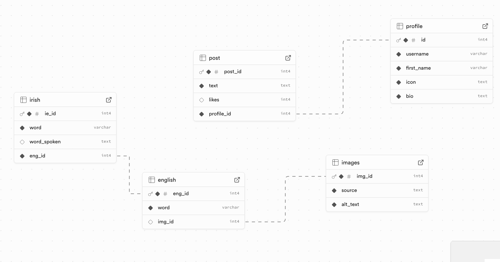
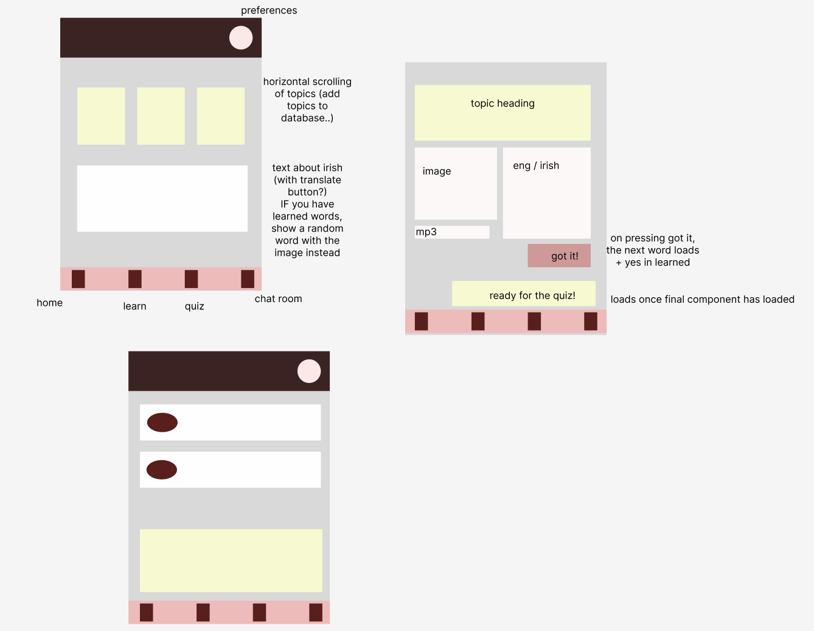

# Focal

An app to help and connect learners of the Irish language 🇮🇪🧑‍🏫

focal (meaning: a word) &
<a href="https://www3.smo.uhi.ac.uk/gaeilge/donncha/focal/focal044.html">cúpla focal = a few words (the amount of Irish that any Irishman can produce, if pressed)</a>

## Aims & Planning

For this assignment I knew I wanted to use a relational database, and I challenged myself to try and design a database that didn't (entirely) rely on the posts/tags example we worked through as a workshop. Originally, I wanted to develop an app that would allow non-verbal users to play soundbites from a wordbank -- scalability would come in the form of a wordbank growing, as well as non-English wordbanks, to account for other users. However, although I was passionate about this idea, the process of designing a schema kept tripping me up, so I went back to square 1.5 and instead decided to create an app that would play soundbites of Irish words for English speakers who are attempting to learn the language.

This was still a project full of passion from the outset, as I have strong feelings about keeping the language alive, and I hope that the process of building this app will bring me a couple of steps forward in working on my original idea (b ᵔ▽ᵔ)b

I wrote my own user stories for this assignment (the overall aims are of course inclusive of the provided user stories in our assignment brief) and employed (for free) my girlfriend to work as a pseudo beta-tester -- as someone who has no knowledge of Irish, I was curious if the app could actually help her learn even a single word, and if the design was user-friendly to people who are not the person building the app...

**User Stories**

📗 I want the user to be able to chat to others learning the language

📗 I want the user to be able to learn words in another language easily and without the process feeling like a chore

📗 I want the website to be accessible for those who may rely on assistive technology, and for these users to be able to learn and interact as much and as easily as other users

## Designing

The process started with the design of my database: listing what tables I thought would be needed and then the columns in each table. I did this on a sheet of paper originally, but then moved to <a href="https://drawsql.app/teams/professional-fun-haver/diagrams/language-app/embed">drawing the schema on drawSQL</a> (link should lead to the relevant diagram, but just as a failsafe see below)

Once I felt like I had reached a solid foundation and that my logic was correct, I asked for feedback from Tim and talked through my aims and what I was attempting to achieve. Tim advised removing a few foreign keys (for example, I originally had a foreign key for posts within profile, which was unncessary) but otherwise gave it the go-ahead, and I moved to visually designing the app in Figma.

From a mobile-first POV I designed a rough wireframe, keeping in mind the components that would create each aspect of the site, and mocked up a screen for each step of the user journey.

I chose a <a href="https://pixelied.com/colors/palette-editor/3d348b-7678ed-f7b801-f18701-f35b04">colour palette</a> and fonts in order to replicate a similar feeling to the <a href="https://minorfigures.com">Minor Figures</a> website, which I kind of pin-point as some sort of middle ground between the current design trends of <a href="https://cari.institute/aesthetics/acidgrafix">Acidgrafix</a> and <a href="https://cari.institute/aesthetics/paperback-chic">Paperback Chic</a>. (I'm certain there must be a better description of the design, as it is reminiscent of current graphic poster-design).

## Resources

⭐️ <a href="https://fonts.google.com/share?selection.family=Source+Code+Pro:ital,wght@0,200..900;1,200..900">Source Code Pro</a>

⭐️ <a href="https://fonts.google.com/share?selection.family=Rammetto+One">Rammetto One</a>

⭐️ <a href="https://www.svgrepo.com/collection/animal-outlined-sepia-icons/">Icon Collection</a>

⭐️ <a href="https://www.svgrepo.com/svg/503994/chat-communication-conversation">favicon creation (edited with the in-website tools)</a>

⭐️ <a href="https://www.learn-irish.net/irishvocabulary?topic=pets&level=secondary">Soundbites (accessed via viewing source)</a>

⭐️ <a href="https://cari.institute/aesthetics?asc=true&sort=name">Index of aesthetics</a>
